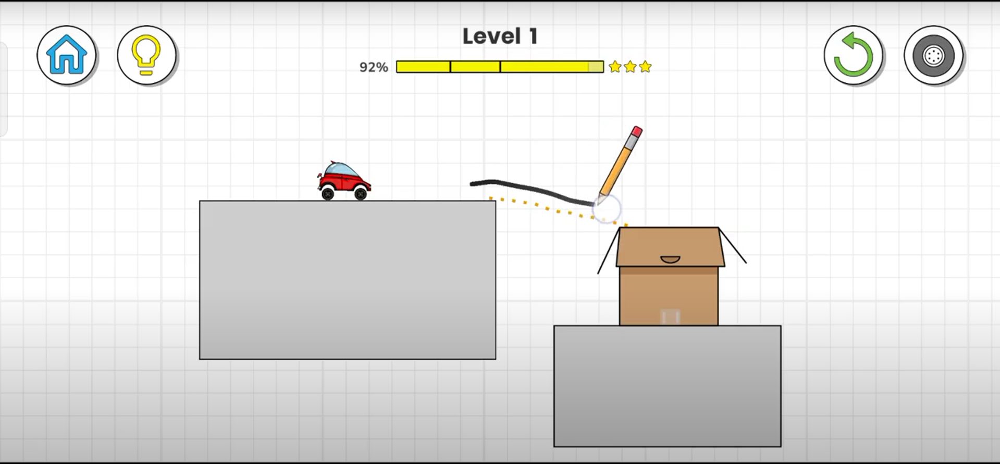
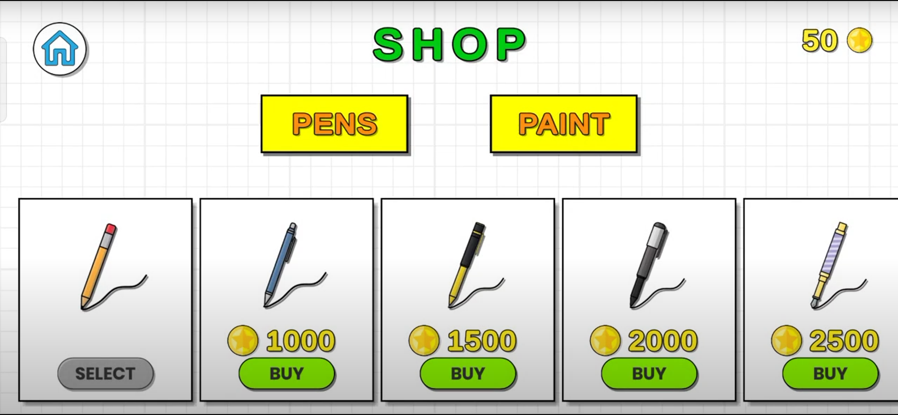

# 🌀 Line‑Drifter

**Line‑Drifter** is a level‑based Unity game inspired by *Happy Glass*, where players draw lines to solve puzzles and help a car reach in its box.  
It features intuitive physics-based gameplay, progression across multiple levels, a shop system, and ad integration — wrapped in a minimalist aesthetic.

---

## 📸 Screenshots

### 🧩 Gameplay

### 🛒 Shop Screen

---

## 🎥 Gameplay Video

  

---

## ✨ Features

- 🎯 **Physics-based drawing mechanics**
- 🧠 **Level progression** with increasing difficulty
- 🛍️ **Shop system** for skins/items
- 💾 **Save & delete** level progress
- 🎨 **Custom art** assets made with Photoshop & Illustrator
- 📺 **Ad integration** for monetization
- 🎮 Inspired by *Happy Glass* and puzzle-based mobile games

---

## 🛠️ Tech Stack

- 🧱 **Engine**: Unity (2D)
- 🧠 **Scripting**: C#
- 🎨 **UI/Graphics**: Photoshop, Illustrator
- 🎵 **Audio**: Unity Audio System
- 🧪 **Testing**: Manual device testing (Android)

---

## 🗺️ Roadmap

- [x] Core line-drawing physics
- [x] Level unlock and save system
- [x] Shop UI and logic
- [x] Advertisement support
- [ ] Power-ups and level modifiers
- [ ] Settings menu (audio toggle, reset progress)
- [ ] Export and publish to Google Play

---

## 🙌 Credits

- Developed by [Nikhil Bansal]([https://www.linkedin.com/in/nikhilbansal30])
- Inspired by puzzle classics like *Happy Glass*

---

## 📬 Contact

Have questions or feedback?  
Feel free to reach out via [GitHub](https://github.com/Nikhil9182) or open an issue in the repo.

---

